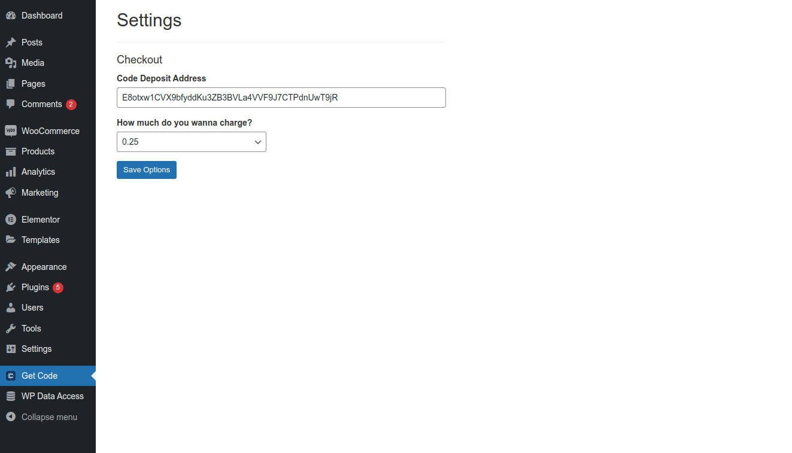
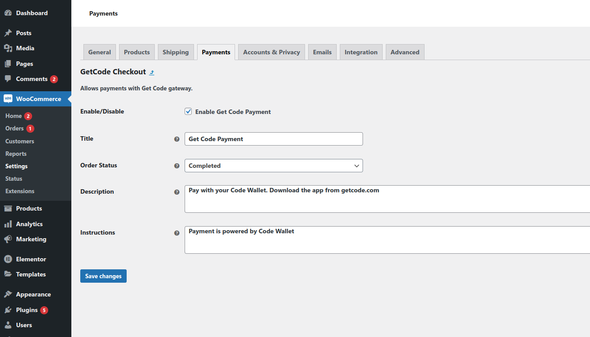

# Code WordPress Plugin

The Code WordPress Plugin is a library that empowers WordPress developers to easily integrate Code payments into their website.

## Description

Code is a mobile wallet app that leverages self-custodial blockchain technology to deliver a seamless payments experience that is instant, global, and private. With minimal setup and support for Gutenberg and Elementor, and classic editor (using a short code), you can start accepting payments effortlessly.

**Features:**
- WooCommerce checkout integration. Allow users to pay for products using Code Wallet.
- Content Paywall integration with support for classic, Gutenberg, and Elementor editors. Allow users to pay for selected posts and pages using Code Wallet.

## Installation

1. Upload the entire `wp-get-code` directory to the `/wp-content/plugins/` directory.
2. Activate the plugin through the 'Plugins' menu in WordPress.

## Frequently Asked Questions

1. **How do I use Code payments as a paywall on Wordpress site?**
   [link to Video.]

2. **Can I use this plugin with the classic editor?**
   Yes, the plugin supports the classic editor using a provided short code.

## Screenshots

*Options for Paywall and Destinaton address*

*Woocommerce checkout options*

## Changelog

### 1.0.0
- Initial release.

## Upgrade Notice

### 1.0.0
- This is the initial version.
